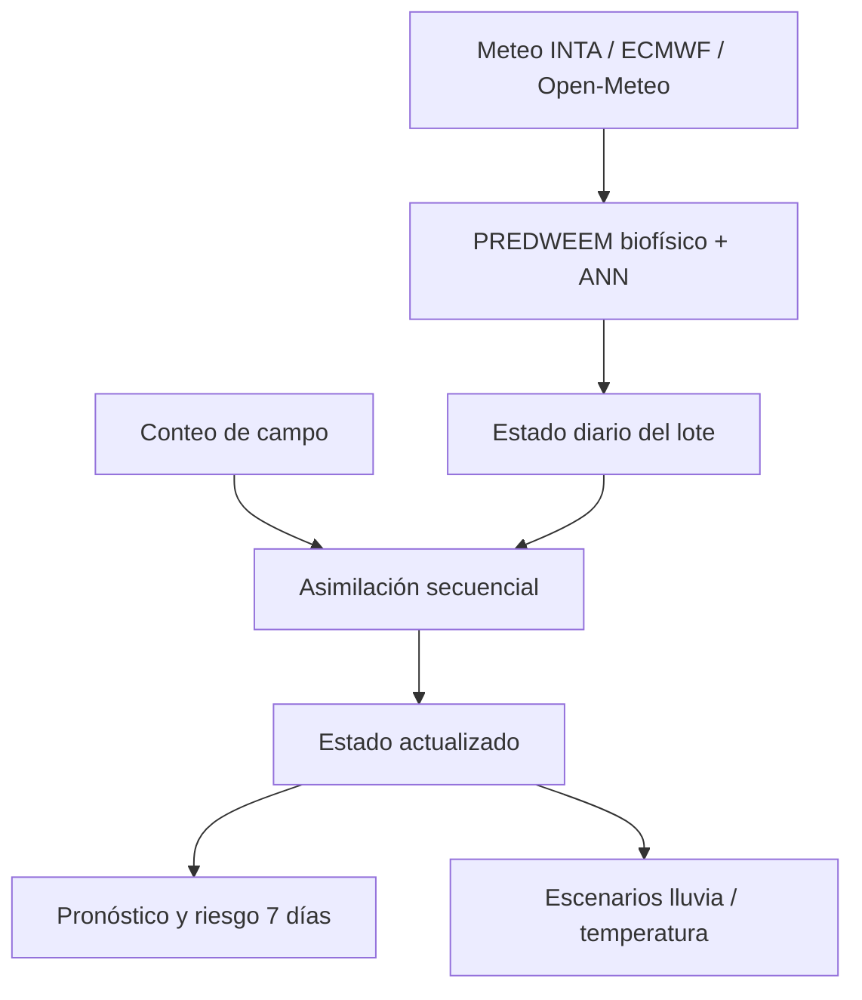

# PREDWEEM Digital Twin — Lolium Bordenave

Primera implementación funcional de un **gemelo digital agronómico** para la
dinámica de emergencia de *Lolium multiflorum* en Bordenave, Buenos Aires.

El proyecto deriva del modelo científico
[`PREDWEEM/LOLIUM_BOR2026`](https://github.com/PREDWEEM/LOLIUM_BOR2026), que se
mantiene intacto. Este repositorio agrega una capa independiente de estado,
asimilación de observaciones, persistencia por lote y simulación de escenarios.

## Qué convierte esta versión en un gemelo digital



El sistema mantiene explícitamente:

- emergencia acumulada y fracción remanente;
- humedad superficial estimada y factor hídrico;
- tiempo térmico desde el primer pico y límite operativo de 800 °Cd;
- termoinhibición, próxima cohorte y riesgo a siete días;
- observaciones, innovaciones y estados posteriores de cada asimilación;
- fuente meteorológica y parámetros utilizados.

## Asimilación de datos

Los conteos en plantas/m² se interpretan como el flujo ocurrido desde el
muestreo anterior. Para cada intervalo, el gemelo suma el flujo diario relativo
producido por PREDWEEM y lo compara con el flujo observado:

\[
Y_i = N \sum_{d=t_{i-1}+1}^{t_i} e_d
\]

donde `Y_i` es el flujo observado, `e_d` el flujo diario relativo y `N` el
potencial estacional latente. La aplicación estima `N` secuencialmente sin
tratar una serie parcial como si estuviera completa. Puede incorporarse un
potencial histórico previo del lote; el valor `0` activa la estimación
automática.

La corrección de cada flujo utiliza una ganancia escalar:

\[
K = \frac{P}{P + R}, \qquad x^+ = x^- + K(y-x^-)
\]

donde `P` y `R` son las varianzas del modelo y del flujo observado. Después de
cada corrección, la curva futura se reancla sobre la fracción aún no emergida.
Los archivos que ya contienen acumulados normalizados mantienen el método
escalar anterior como modo de compatibilidad. No se reentrena la ANN.

## Operación con meteorología parcial

El modo operativo supone que cada ejecución dispone de meteorología observada
hasta la fecha del estado y de un pronóstico para los siete días siguientes:

```text
1 de enero ───────── fecha del estado ───────── +7 días
       observado/provisional            pronóstico
```

La última fila no marcada como `Pronostico` define automáticamente la fecha del
estado. La aplicación recorta cualquier extensión posterior al séptimo día e
informa cuántos días de pronóstico están realmente disponibles.

La curva parcial no se normaliza por el total existente al final de esos siete
días. PREDWEEM utiliza como referencia el progreso acumulado mediano de las
campañas históricas del modelo, excluyendo 2010 y 2015, y ancla la escala en la
fecha del estado. De esta manera, el final del pronóstico no se interpreta como
100 % de la emergencia. Las temperaturas y precipitaciones pronosticadas
determinan el incremento de emergencia de los siete días siguientes. Los
conteos de campo actualizan posteriormente ese estado mediante la asimilación.

Sin siete días futuros, el sistema conserva el estado disponible y muestra una
advertencia de horizonte incompleto; no presupone que la campaña terminó.

## Funciones de la aplicación

- meteorología operativa INTA Bordenave + ECMWF;
- alternativa georreferenciada de Open-Meteo;
- carga de meteorología CSV/XLSX;
- cobertura del rastrojo constante o serie observada `FECHA + COBERTURA_PCT`;
- estado persistente por identificador de lote en SQLite;
- asimilación directa de conteos por intervalo con incertidumbre;
- carga masiva de observaciones CSV/XLS/XLSX en formato `FECHA + PLM2` o
  `FECHA + EMERGENCIA_ACUMULADA`;
- curva PREDWEEM base frente a estado Twin actualizado;
- banda amarilla de la ventana fenológica entre 600 y 800 °Cd desde el primer pico;
- escenarios contrafactuales de lluvia y temperatura;
- fechas d25, d50, d75 y d95;
- exportación CSV de la trayectoria completa y auditable.

## Cobertura variable del rastrojo

La interfaz permite seleccionar **Constante** o **Serie observada**. La serie
observada se carga por lote en CSV/XLS/XLSX con esta estructura:

| FECHA | COBERTURA_PCT |
|---|---:|
| 2026-03-01 | 82 |
| 2026-03-15 | 70 |

Los valores deben estar entre 0 y 100. El gemelo interpola linealmente entre
mediciones. Antes de la primera utiliza la cobertura de respaldo configurada en
la barra lateral y, después de la última, conserva el último valor observado.
La cobertura diaria actualiza `Ke_Suelo` y el balance hídrico que condiciona el
flujo de emergencia. También actualiza las temperaturas superficiales estimadas
mediante el modulador térmico, sin modificar las entradas originales de la ANN.
Las mediciones quedan guardadas de forma independiente para cada lote.

## Ejecución local

```bash
python -m venv .venv
source .venv/bin/activate
python -m pip install -r requirements.txt
streamlit run app.py
```

En Windows PowerShell, active el entorno con `.venv\\Scripts\\Activate.ps1`.

## Pruebas

```bash
python -m pytest -q
```

Las pruebas verifican límites biofísicos, monotonía del estado asimilado,
trazabilidad de la corrección y aislamiento de escenarios futuros.

## Formato de observaciones de campo

La pestaña **Observaciones** acepta dos estructuras:

| Fecha | Valor | Interpretación |
|---|---:|---|
| `FECHA` | `PLM2` | Flujo de plantas/m² observado en cada intervalo de muestreo |
| `FECHA` | `EMERGENCIA_ACUMULADA` u `OBSERVADO` | Acumulado expresado entre 0–1 o 0–100 % |
| `Fecha` + `1`, `2`, `3` | `media(SR).m2` | Tres repeticiones por cuadrante y su media convertida a plantas/m² |

El mismo archivo puede incluir una columna opcional `COBERTURA_PCT` o
`cobertura`. Al confirmar la carga, la aplicación guarda simultáneamente los
flujos de emergencia y la serie de cobertura para el lote. La validación exige
valores de cobertura entre 0 y 100.

Para `PLM2`, la aplicación conserva cada flujo y su acumulado absoluto. El
potencial estacional combina el progreso estructural de PREDWEEM con el ajuste
de los flujos por intervalo. El ajuste recibe más peso cuando reproduce bien la
forma observada y menos peso cuando la correspondencia temporal es débil. Esto
evita convertir prematuramente una campaña incompleta en 100 % de emergencia.

Cuando el archivo contiene repeticiones, la aplicación comprueba que la media
sea consistente, infiere el factor de conversión del cuadrante a m² y calcula la
incertidumbre desde el error estándar del flujo. Se aplica un mínimo de 5 % para
incorporar variación espacial y de muestreo no representada por tres cuadrantes.

La incertidumbre de las repeticiones se calcula sobre el flujo de cada intervalo
y el potencial estacional mantiene su propia incertidumbre. La interfaz muestra
por separado el acumulado estimado en plantas/m², el potencial estacional y el
progreso relativo.

### Diagnóstico retrospectivo del corte al 5 de abril

Con los datos Bordenave 2026 disponibles únicamente hasta el 30 de marzo, el
nuevo método utilizó nueve flujos, estimó un potencial de 7770 plantas/m² y un
estado actualizado de 75,3 %. El valor retrospectivo calculado al completar la
campaña fue 71,7 %. El RMSE acumulado posterior fue 2,2 puntos porcentuales a
30 días y 2,7 puntos a 60 días. Es un diagnóstico interno de una campaña, no
una validación prospectiva independiente.

## Alcance científico

Esta es una **versión MVP experimental** del gemelo digital. El motor base
mantiene la parametrización de Bordenave vK4.9.15. La capa de asimilación debe
validarse prospectivamente con observaciones independientes antes de usarse de
forma operativa. Los escenarios son contrafactuales y no constituyen una
recomendación automática de tratamiento.

PREDWEEM apoya decisiones; no reemplaza el monitoreo del lote, el diagnóstico
local ni el criterio del profesional responsable.

## Autoría

**PREDWEEM by Guillermo R. Chantre**

Consulte [COPYRIGHT.md](COPYRIGHT.md) para las condiciones de uso.
La correspondencia con el motor original se documenta en
[MODEL_PROVENANCE.md](MODEL_PROVENANCE.md).

## Cierre meteorológico de la campaña 2026

La serie operativa termina el **1 de octubre de 2026, inclusive**. El límite
se aplica a SIGA, al puente provisional, al pronóstico ECMWF, a la consulta
Open-Meteo y a los archivos cargados en la aplicación. Después del cierre,
las actualizaciones pueden completar o reemplazar datos provisionales por
observaciones hasta esa fecha, sin agregar días posteriores ni exigir
pronósticos futuros. La interfaz reduce el horizonte esperado al acercarse
al cierre. Las referencias históricas de emergencia mantienen su extensión.
