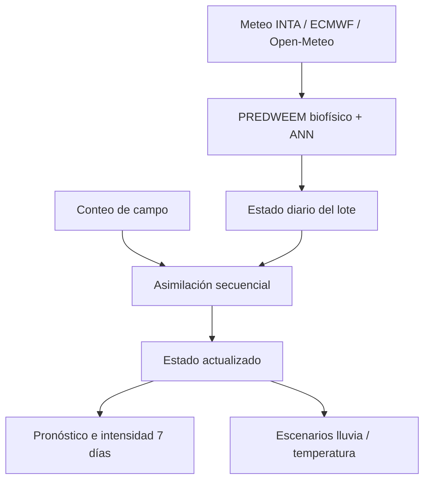

# PREDWEEM Digital Twin — Lolium Bordenave

Primera implementación funcional de un **gemelo digital agronómico** para la
dinámica de emergencia de *Lolium multiflorum* en Bordenave, Buenos Aires.

El proyecto deriva del modelo científico
[`PREDWEEM/LOLIUM_BOR2026`](https://github.com/PREDWEEM/LOLIUM_BOR2026), que se
mantiene intacto. Este repositorio agrega una capa independiente de estado,
asimilación de observaciones, persistencia por lote y simulación de escenarios.

## Visitas periódicas para reducir la hibernación

El workflow [mantener_activo.yml](.github/workflows/mantener_activo.yml) abre
[la aplicación de Bordenave](https://nhfm7pn5fzkd5shigp2vyh.streamlit.app/)
con Chromium cada cuatro horas: 00:29, 04:29, 08:29, 12:29, 16:29 y 20:29 UTC
(21:29, 01:29, 05:29, 09:29, 13:29 y 17:29 de Argentina).
También permite ejecución manual desde
**Actions → Mantener activo el gemelo Bordenave → Run workflow** y se ejecuta
al modificar el workflow o su script.

Cuando aparece **Yes, get this app back up!**, la tarea hace clic en el botón
y espera la apertura, con un límite total de cinco minutos. Comprueba el
encabezado de Bordenave, el indicador de emergencia, el panel principal y su
gráfico, incluso si están dentro de un iframe. Una respuesta HTTP 200 por sí
sola no cuenta como éxito. Si la app muestra una excepción o no termina de
cargar, la ejecución queda fallida; los avisos dependen de las preferencias
de notificaciones de GitHub Actions.

La tarea no requiere secretos ni modifica observaciones o parámetros del modelo.
Playwright se instala solamente en el ejecutor de Actions. Esto reduce el riesgo
de hibernación, pero **no garantiza disponibilidad continua**:
[Streamlit suspende las apps sin visitas durante 12 horas](https://docs.streamlit.io/deploy/streamlit-community-cloud/manage-your-app#app-hibernation)
y [GitHub puede demorar tareas o desactivarlas tras 60 días sin actividad en un repositorio público](https://docs.github.com/en/actions/reference/workflows-and-actions/events-that-trigger-workflows#schedule).
Si ocurre lo último, vuelva a habilitar el workflow desde Actions.

## Qué convierte esta versión en un gemelo digital



El sistema mantiene explícitamente:

- emergencia acumulada y fracción remanente;
- humedad superficial estimada y factor hídrico;
- tiempo térmico desde el primer pico y límite operativo de 800 °Cd;
- termoinhibición, próxima cohorte e intensidad de emergencia a siete días;
- observaciones, innovaciones y estados posteriores de cada asimilación;
- fuente meteorológica y parámetros utilizados.

## Asimilación de datos

Los conteos en plantas/m² se interpretan como el flujo ocurrido desde el
muestreo anterior. Para cada intervalo, el gemelo suma el flujo diario relativo
producido por PREDWEEM y lo compara con el flujo observado:

\[
Y_i = N \sum_{d=t_{i-1}+1}^{t_i} e_d
\]

donde `Y_i` es el flujo observado, `e_d` el flujo diario relativo y `N` el
potencial estacional latente. La aplicación estima `N` secuencialmente sin
tratar una serie parcial como si estuviera completa. Puede incorporarse un
potencial histórico previo del lote; el valor `0` activa la estimación
automática.

La corrección de cada flujo utiliza una ganancia escalar:

\[
K = \frac{P}{P + R}, \qquad x^+ = x^- + K(y-x^-)
\]

donde `P` y `R` son las varianzas del modelo y del flujo observado. Después de
cada corrección, la curva futura se reancla sobre la fracción aún no emergida.
Los archivos que ya contienen acumulados normalizados mantienen el método
escalar anterior como modo de compatibilidad. No se reentrena la ANN.

## Operación con meteorología parcial

El modo operativo supone que cada ejecución dispone de meteorología observada
hasta la fecha del estado y de un pronóstico para los siete días siguientes:

```text
1 de enero ───────── fecha del estado ───────── +7 días
       observado/provisional            pronóstico
```

La última fila no marcada como `Pronostico` define automáticamente la fecha del
estado. La aplicación recorta cualquier extensión posterior al séptimo día e
informa cuántos días de pronóstico están realmente disponibles.

La curva parcial no se normaliza por el total existente al final de esos siete
días. PREDWEEM utiliza como referencia el progreso acumulado mediano de las
campañas históricas seleccionadas, excluyendo 2010, 2015, Balcarce, San Pedro y Tres Arroyos 2025,
y ancla la escala en la
fecha del estado. De esta manera, el final del pronóstico no se interpreta como
100 % de la emergencia. Las temperaturas y precipitaciones pronosticadas
determinan el incremento de emergencia de los siete días siguientes. Los
conteos de campo actualizan posteriormente ese estado mediante la asimilación.

El pool reúne **nueve referencias**: **2008, 2009, 2011, 2012, 2013, 2014,
2023, 2024 y Bordenave 2026**. Las primeras ocho son archivos identificados
sólo por año; esos nombres no acreditan que todas procedan de Bordenave.
Una lista explícita impide incorporar automáticamente otras curvas. Se excluyen
2010, 2015, Balcarce, San Pedro y Tres Arroyos 2025 **antes** de calcular
P10, mediana y P90. El clasificador original permanece intacto.

**Disponibilidad temporal:** el total de Bordenave 2026 se conoce desde el
último conteo del **14/09/2026**. Los cortes anteriores usan sólo las ocho
series previas. Desde esa fecha, incluidas las consultas de 2027, participan
las nueve referencias. La aplicación, los escenarios y cada corte de las
evaluaciones de calibración utilizan el mismo criterio.

Para 2026 se emplean los 33 registros de
`data/calibration/bordenave_2026_counts.csv`, del 10/01 al 14/09. Se suma
`media(SR).m2`, se divide por el total registrado (**7041,33 plantas/m²**) y se
interpola el acumulado entre visitas. Cada una de las nueve campañas tiene
**igual peso**, independientemente de su densidad. No se promedia primero el
resumen de las ocho curvas con 2026 como dos grupos de igual peso.

Antes del 10/01, la curva 2026 queda desconocida y el resumen usa las ocho
curvas previas. Para evitar retrocesos al cambiar la composición disponible,
se conserva el máximo acumulado de cada cuantil. Las columnas `*_Empirico`
permiten auditar los cuantiles sin esa regularización. Después del último
conteo, 2026 mantiene el total de su ventana como supuesto de referencia:
no son nuevas observaciones ni prueba de cierre biológico de la campaña.
Los percentiles describen el pool; no son intervalos de confianza.

La interfaz y el perfil JSON registran campañas utilizadas y excluidas.
**Trazabilidad → Curvas de la referencia local** permite descargar el pool,
incluyendo las nueve curvas normalizadas y el número de campañas por día.
Incorporar 2026 al pool no carga esos conteos como observaciones de un lote.

Sin siete días futuros, el sistema conserva el estado disponible y muestra una
advertencia de horizonte incompleto; no presupone que la campaña terminó.

### Gráficos y configuración

La configuración aparece en el cuerpo, sin panel lateral. La vista principal
presenta **dos gráficos a la par**: flujo y emergencia acumulada, con eje
temporal del 1 de enero al **1 de octubre**. El selector **Semanal/Diario**
se inicia en Semanal. El fondo tenue muestra únicamente el **pool histórico
orientativo**, sin curvas individuales de años; continúa después de la fecha
del estado para visualizar la trayectoria de referencia del resto del período.
El gemelo sólo se extiende hasta la meteorología disponible, como máximo siete
días después del corte. El fondo histórico no crea meteorología ni pronósticos.

Los dos flujos se representan en **% del total por día o por semana**. Un 2 %
equivale a dos puntos porcentuales del acumulado. El histórico usa los totales
de sus ventanas registradas; el gemelo usa su total estacional estimado. El
flujo histórico se deriva de diferencias del acumulado mediano, no de conteos
diarios. La interpolación y la combinación de campañas suavizan sus picos.
Las semanas son de lunes a domingo, sin renormalizar; las barras parciales
aparecen rayadas y especifican sus días disponibles. El acumulado no cambia
al alternar la frecuencia. Los períodos sin referencia se mantienen desconocidos.

### Intensidad de emergencia a siete días

`Índice = flujo del gemelo de mañana a siete días después / máximo semanal del pool`.

El numerador suma siete flujos diarios futuros. El denominador utiliza el mismo
pool que los gráficos, trasladado al calendario consultado, y sólo semanas
completas de lunes a domingo dentro del eje enero–1 de octubre. No es el máximo
diario ni el máximo individual de una campaña. Ambas magnitudes se calculan
en la misma escala fraccional y se muestran como porcentajes.

| Intensidad | Condición |
| --- | --- |
| 🔴 Alta | Más del 75 % del máximo semanal histórico |
| 🟠 Media | Del 25 al 75 %, inclusive |
| 🟡 Baja | Flujo positivo y menor al 25 % del máximo |
| 🟢 Nula | Flujo semanal exactamente igual a cero |

Se requieren siete fechas futuras válidas: un horizonte incompleto se indica
en gris, sin clasificarlo como Bajo o Nulo. Con flujo positivo pero sin un
máximo histórico válido se muestra «Sin referencia». El intervalo futuro
móvil puede abarcar partes de dos semanas calendario. El selector del gráfico
no cambia este cálculo. Es intensidad relativa, no probabilidad de emergencia.

### Semáforo del tiempo térmico desde el primer pico

| Indicador | TT acumulado |
| --- | --- |
| 🔴 FUERA DE CONTROL | >800 °Cd |
| 🟠 ULTIMO PLAZO | >700 y ≤800 °Cd |
| 🟡 CONTROL A TIEMPO | ≥600 y ≤700 °Cd |
| 🟢 AUN NO CONTROLAR | <600 °Cd |

La categoría se determina con el valor sin redondear en la fecha del estado.
Se conservan los parámetros fisiológicos, pesos y meteorología de Bordenave;
no se incorpora el decaimiento específico de Tres Arroyos.

## Funciones de la aplicación

- meteorología operativa INTA Bordenave + ECMWF;
- alternativa georreferenciada de Open-Meteo;
- carga de meteorología CSV/XLSX;
- cobertura del rastrojo constante o serie observada `FECHA + COBERTURA_PCT`;
- estado persistente por identificador de lote en SQLite;
- asimilación directa de conteos por intervalo con incertidumbre;
- carga masiva de observaciones CSV/XLS/XLSX en formato `FECHA + PLM2` o
  `FECHA + EMERGENCIA_ACUMULADA`;
- curva PREDWEEM base frente a estado Twin actualizado;
- banda amarilla de la ventana fenológica entre 600 y 800 °Cd desde el primer pico;
- escenarios contrafactuales de lluvia y temperatura;
- fechas d25, d50, d75 y d95;
- exportación CSV de la trayectoria completa y auditable.

## Calibración por sitio con observaciones 2026

La pestaña **Calibración por sitio** contiene las 33 fechas del archivo
`valida(3).xlsx`, hoja `Hoja1`, del 10/01 al 14/09/2026, asignadas a Bordenave
según la solicitud del autor. Se conservan las tres repeticiones y la media
original en `data/calibration/bordenave_2026_counts.csv`. El factor inferido
de conversión a m² es 4. El total registrado es **7041,33 plantas/m²** y no
se interpreta como el potencial estacional de una campaña terminada.

La capa externa aplica una transformación monótona al acumulado base:

\[
F_{local}=\operatorname{logistic}(a+b\operatorname{logit}(F_{base})).
\]

Se conservan los extremos 0 y 1, los días sin flujo, los pesos de la ANN,
el balance hídrico, la termoinhibición y el reloj de 600–800 °Cd. La corrección
puede modificar el progreso relativo y la distribución del flujo, pero no
crear una cohorte donde los filtros biofísicos bloquean la emergencia.

El ajuste compara las sumas del flujo entre fechas de conteo con los flujos
observados. Hay **32 intervalos utilizables**, incluido el de 14 días entre
el 1 y el 15 de junio. El archivo actualizado incorpora un registro de cero
el **10/01/2026**. Ese registro delimita el primer intervalo, de **23 días**,
hasta el 02/02/2026, cuyo conteo de **713,33 plantas/m²** participa ahora del
ajuste. No se infiere ausencia de emergencia antes del 10 de enero.
No se interpolan observaciones diarias. Se pondera por el error estándar de
las repeticiones con un piso común del 10 % del máximo flujo observado
(mínimo 1 planta/m²). El ajuste se regulariza hacia la identidad y se limita
a `a ∈ [-1.5, 1.5]` y `b ∈ [0.6, 1.6]`.

Cada curva se escala al **total de la ventana muestreada**, sin declarar que
esa ventana contiene el 100 % de la emergencia. La escala auxiliar sirve
para comparar los intervalos; **no se transfiere como potencial o densidad
a otro lote**. El potencial sigue siendo estimado por la asimilación existente.

### Uso en el gemelo

- Seleccionar **Localidad del lote: Bordenave**. **Usar calibración local 2026**
  está activado por defecto y puede desactivarse sobre los gráficos. El pool
  histórico se mantiene: la referencia estacional y la calibración son capas distintas.
- El perfil se aplica antes de la asimilación y también a los escenarios.
  El gráfico permite comparar base, calibración y estado actualizado.
- No se aplica a otra localidad ni a una fecha anterior al 14/09/2026.
  Los gráficos del año de ajuste son retrospectivos; esta revisión del perfil
  se preparó el 22/09/2026 y no se presenta como disponible en un pronóstico histórico real.
- Si se están asimilando conteos de la campaña 2026, se utiliza la base
  original para evitar reutilizar esa campaña como calibración y evidencia
  nueva. El perfil permanece guardado para campañas posteriores; sus conteos
  nuevos sí pueden asimilarse sobre la trayectoria calibrada.
- Los datos de referencia no sobrescriben SQLite ni se insertan automáticamente
  en los lotes. La pestaña permite descargarlos para cargarlos en Observaciones.
- La exportación incluye `EMERAC_BASE_SIN_CALIBRAR`, `EMERAC_CALIBRADA`,
  `EMERREL_CALIBRADA`, identificación del perfil, motivo y estado de aplicación.
- Un cambio de pesos, filtros o referencia histórica invalida la huella del
  perfil; se usa la base original hasta regenerar la calibración.

La capa admite campañas posteriores, pero la aplicación y su actualizador
mantienen el cierre meteorológico **01/10/2026**. Al abrir una nueva campaña
deberá configurarse su meteorología; este cambio no modifica ese cierre.

### Resultado y alcance

El ajuste inicial usa cobertura constante del **50 %** y Wmax **18,8 mm**,
que son los valores de la interfaz. El archivo de conteos no aporta cobertura,
manejo. La meteorología congelada contiene
250 días SIGA y 7 provisionales, hasta el 14/09/2026. Los cambios de cobertura
y Wmax en la interfaz siguen siendo posibles, pero no implican que el perfil
se haya validado bajo esas condiciones.

El perfil es **experimental, de una sola campaña incompleta**. El RMSE de
ajuste por intervalo pasa de **393,13 a 356,93 plantas/m²** sobre los datos
empleados para estimarlo. Ninguno de los dos parámetros del perfil final
alcanza los límites permitidos. Estos RMSE corresponden a 32 intervalos:
no son directamente comparables con los de la revisión anterior, que excluía
el conteo del 2 de febrero y ajustaba sobre 31 intervalos.

Se incluyen seis evaluaciones temporales: se ajusta sólo con datos hasta
cada corte y se evalúa el siguiente intervalo con meteorología
observada/provisional. Se conservan las seis fechas de corte de la revisión
anterior, registradas en `validation_cutoffs`, para que la incorporación de
una fecha inicial no cambie los intervalos evaluados. El RMSE conjunto pasa
de **165,01 a 107,19 plantas/m²**, pero sólo un intervalo mejora; la reducción
se concentra en ese intervalo.
No son pronósticos archivados ni validación en otra campaña. No se reduce
automáticamente la incertidumbre del gemelo ni se infiere precisión para 2027.
Estos diagnósticos se regeneraron al reemplazar Tres Arroyos 2025 por Bordenave
2026 en el pool. Cada evaluación anterior al 14/09 usa sólo las ocho series
previas, sin el total 2026 conocido después. Los conteos, la meteorología fija,
los cortes y los pesos neuronales son los mismos. El perfil conserva offset
0,50 y slope 1,35, con una identidad y huella nuevas, que incluyen el CSV 2026.

### Reproducción

```bash
python scripts/calibrate_site.py
python -m pytest -q
```

El generador usa los CSV fijos de `data/calibration/`, conserva los hashes
del archivo original, observaciones, meteorología y modelo, y produce
`bordenave_2026.json`, `bordenave_2026_fit.csv` y `bordenave_2026_holdout.csv`.
No descarga datos ni reentrena la red. Para actualizar el perfil, incorporar
los nuevos conteos y su meteorología, revisar los supuestos y regenerarlo.
La identificación del perfil incluye una huella de sus datos y configuración,
por lo que cambia ante revisiones aunque la última fecha de conteo sea la misma.

## Cobertura variable del rastrojo

La interfaz permite seleccionar **Constante** o **Serie observada**. La serie
observada se carga por lote en CSV/XLS/XLSX con esta estructura:

| FECHA | COBERTURA_PCT |
|---|---:|
| 2026-03-01 | 82 |
| 2026-03-15 | 70 |

Los valores deben estar entre 0 y 100. El gemelo interpola linealmente entre
mediciones. Antes de la primera utiliza la cobertura de respaldo configurada en
la barra lateral y, después de la última, conserva el último valor observado.
La cobertura diaria actualiza `Ke_Suelo` y el balance hídrico que condiciona el
flujo de emergencia. También actualiza las temperaturas superficiales estimadas
mediante el modulador térmico, sin modificar las entradas originales de la ANN.
Las mediciones quedan guardadas de forma independiente para cada lote.

## Ejecución local

```bash
python -m venv .venv
source .venv/bin/activate
python -m pip install -r requirements.txt
streamlit run app.py
```

En Windows PowerShell, active el entorno con `.venv\\Scripts\\Activate.ps1`.

## Pruebas

```bash
python -m pytest -q
```

Las pruebas verifican límites biofísicos, monotonía del estado asimilado,
trazabilidad de la corrección y aislamiento de escenarios futuros.

## Formato de observaciones de campo

La pestaña **Observaciones** acepta dos estructuras:

| Fecha | Valor | Interpretación |
|---|---:|---|
| `FECHA` | `PLM2` | Flujo de plantas/m² observado en cada intervalo de muestreo |
| `FECHA` | `EMERGENCIA_ACUMULADA` u `OBSERVADO` | Acumulado expresado entre 0–1 o 0–100 % |
| `Fecha` + `1`, `2`, `3` | `media(SR).m2` | Tres repeticiones por cuadrante y su media convertida a plantas/m² |

El mismo archivo puede incluir una columna opcional `COBERTURA_PCT` o
`cobertura`. Al confirmar la carga, la aplicación guarda simultáneamente los
flujos de emergencia y la serie de cobertura para el lote. La validación exige
valores de cobertura entre 0 y 100.

Para `PLM2`, la aplicación conserva cada flujo y su acumulado absoluto. El
potencial estacional combina el progreso estructural de PREDWEEM con el ajuste
de los flujos por intervalo. El ajuste recibe más peso cuando reproduce bien la
forma observada y menos peso cuando la correspondencia temporal es débil. Esto
evita convertir prematuramente una campaña incompleta en 100 % de emergencia.

Cuando el archivo contiene repeticiones, la aplicación comprueba que la media
sea consistente, infiere el factor de conversión del cuadrante a m² y calcula la
incertidumbre desde el error estándar del flujo. Se aplica un mínimo de 5 % para
incorporar variación espacial y de muestreo no representada por tres cuadrantes.

La incertidumbre de las repeticiones se calcula sobre el flujo de cada intervalo
y el potencial estacional mantiene su propia incertidumbre. La interfaz muestra
por separado el acumulado estimado en plantas/m², el potencial estacional y el
progreso relativo.

### Diagnóstico anterior del corte al 5 de abril

El siguiente diagnóstico corresponde a la referencia anterior, que incluía
Balcarce y San Pedro; no describe la versión actual de nueve curvas.
Con los datos Bordenave 2026 disponibles únicamente hasta el 30 de marzo, el
nuevo método utilizó nueve flujos, estimó un potencial de 7770 plantas/m² y un
estado actualizado de 75,3 %. El valor retrospectivo calculado al completar la
campaña fue 71,7 %. El RMSE acumulado posterior fue 2,2 puntos porcentuales a
30 días y 2,7 puntos a 60 días. Es un diagnóstico interno de una campaña, no
una validación prospectiva independiente.

## Alcance científico

Esta es una **versión MVP experimental** del gemelo digital. El motor base
mantiene la parametrización de Bordenave vK4.9.15. La capa de asimilación debe
validarse prospectivamente con observaciones independientes antes de usarse de
forma operativa. Los escenarios son contrafactuales y no constituyen una
recomendación automática de tratamiento.

PREDWEEM apoya decisiones; no reemplaza el monitoreo del lote, el diagnóstico
local ni el criterio del profesional responsable.

## Autoría

**PREDWEEM by Guillermo R. Chantre**

Consulte [COPYRIGHT.md](COPYRIGHT.md) para las condiciones de uso.
La correspondencia con el motor original se documenta en
[MODEL_PROVENANCE.md](MODEL_PROVENANCE.md).

## Cierre meteorológico de la campaña 2026

La serie operativa termina el **1 de octubre de 2026, inclusive**. El límite
se aplica a SIGA, al puente provisional, al pronóstico ECMWF, a la consulta
Open-Meteo y a los archivos cargados en la aplicación. Después del cierre,
las actualizaciones pueden completar o reemplazar datos provisionales por
observaciones hasta esa fecha, sin agregar días posteriores ni exigir
pronósticos futuros. La interfaz reduce el horizonte esperado al acercarse
al cierre. Las referencias históricas de emergencia mantienen su extensión.
