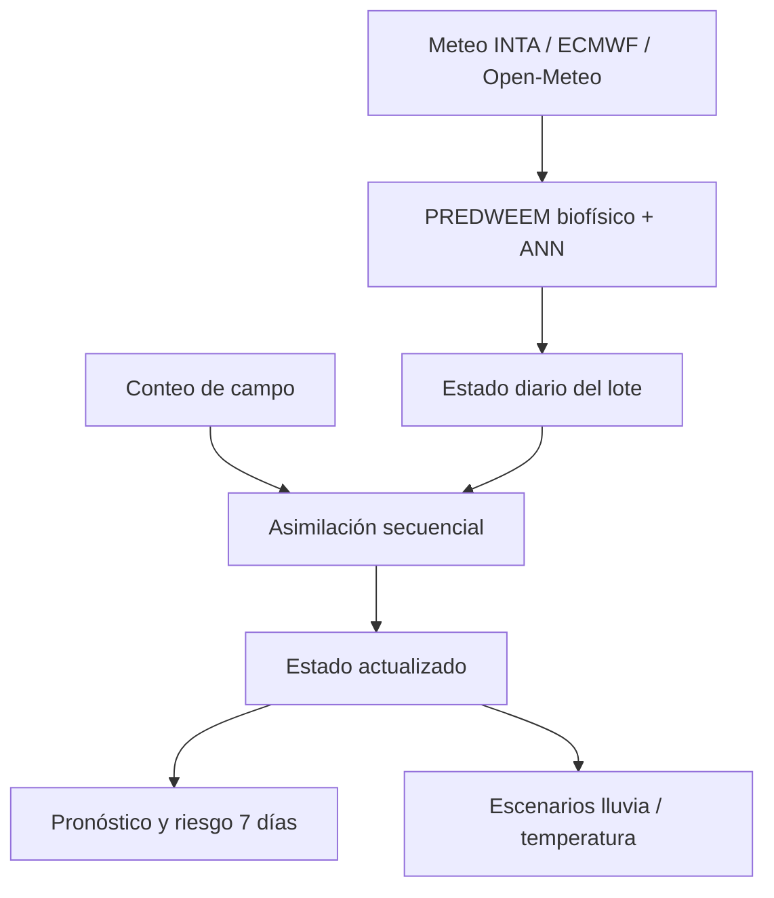

# PREDWEEM Digital Twin — Lolium Bordenave

Primera implementación funcional de un **gemelo digital agronómico** para la
dinámica de emergencia de *Lolium multiflorum* en Bordenave, Buenos Aires.

El proyecto deriva del modelo científico
[`PREDWEEM/LOLIUM_BOR2026`](https://github.com/PREDWEEM/LOLIUM_BOR2026), que se
mantiene intacto. Este repositorio agrega una capa independiente de estado,
asimilación de observaciones, persistencia por lote y simulación de escenarios.

## Qué convierte esta versión en un gemelo digital



El sistema mantiene explícitamente:

- emergencia acumulada y fracción remanente;
- humedad superficial estimada y factor hídrico;
- tiempo térmico desde el primer pico y límite operativo de 800 °Cd;
- termoinhibición, próxima cohorte y riesgo a siete días;
- observaciones, innovaciones y estados posteriores de cada asimilación;
- fuente meteorológica y parámetros utilizados.

## Asimilación de datos

Las observaciones deben expresar la **emergencia acumulada normalizada entre 0
y 1** (la interfaz usa 0–100 %). La actualización utiliza una ganancia escalar:

\[
K = \frac{P}{P + R}, \qquad x^+ = x^- + K(y-x^-)
\]

donde `P` y `R` son las varianzas declaradas del modelo y del conteo. Después de
cada corrección, la curva futura se reancla sobre la fracción aún no emergida.
Así se preservan los forzantes ecofisiológicos de PREDWEEM, la monotonía y los
límites 0–1. No se reentrena ni se recalibra la ANN con cada conteo.

## Funciones de la aplicación

- meteorología operativa INTA Bordenave + ECMWF;
- alternativa georreferenciada de Open-Meteo;
- carga manual de CSV/XLSX;
- estado persistente por identificador de lote en SQLite;
- registro de conteos con incertidumbre;
- curva PREDWEEM base frente a estado Twin actualizado;
- escenarios contrafactuales de lluvia y temperatura;
- fechas d25, d50, d75 y d95;
- exportación CSV de la trayectoria completa y auditable.

## Ejecución local

```bash
python -m venv .venv
source .venv/bin/activate
python -m pip install -r requirements.txt
streamlit run app.py
```

En Windows PowerShell, active el entorno con `.venv\\Scripts\\Activate.ps1`.

## Pruebas

```bash
python -m pytest -q
```

Las pruebas verifican límites biofísicos, monotonía del estado asimilado,
trazabilidad de la corrección y aislamiento de escenarios futuros.

## Alcance científico

Esta es una **versión MVP experimental** del gemelo digital. El motor base
mantiene la parametrización de Bordenave vK4.9.15. La capa de asimilación debe
validarse prospectivamente con observaciones independientes antes de usarse de
forma operativa. Los escenarios son contrafactuales y no constituyen una
recomendación automática de tratamiento.

PREDWEEM apoya decisiones; no reemplaza el monitoreo del lote, el diagnóstico
local ni el criterio del profesional responsable.

## Autoría

**PREDWEEM by Guillermo R. Chantre**

Consulte [COPYRIGHT.md](COPYRIGHT.md) para las condiciones de uso.
La correspondencia con el motor original se documenta en
[MODEL_PROVENANCE.md](MODEL_PROVENANCE.md).
